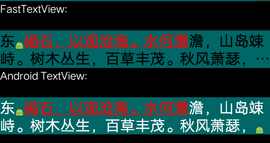
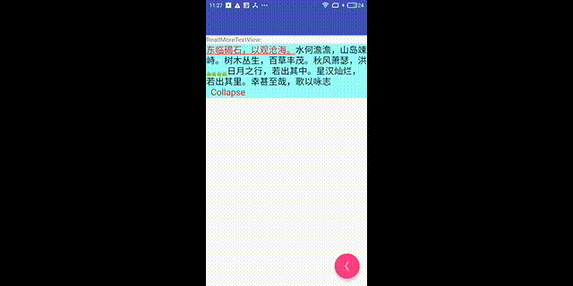

# FastTextView

FastTextView is faster than Android TextView.
FastTextView use StaticLayout to render Spanned String,
so it support most features of Android TextView.

Inspired by :

https://engineering.instagram.com/improving-comment-rendering-on-android-a77d5db3d82e

http://ragnraok.github.io/textview-pre-render-research.html

## Features
1.Faster than Android TextView

2.More flexibility

3.Support Stroke Text
(More accurate method to measure stroke text and italic text)

4.Correct Ellipsis handle with ImageSpan



5.Custom Read More Support




## FastTextView vs Android TextView
Rendering a SpannableString of 389 chars with ClickableSpan and ImageSpan.
Call 'onMeasure'、'onDraw' 1000 times.
Here are the test results on MI MAX (Android 6.0.1):

```
D/FastTextLayoutView: FastTextLayoutView onMeasure cost:0
D/FastTextView: FastTextView onMeasure cost:1
D/TestTextView: TestTextView measure cost:104
D/FastTextLayoutView: FastTextLayoutView onDraw cost:271
D/FastTextView: FastTextView onDraw cost:250
D/TestTextView: TestTextView onDraw cost:249
```
You can see FastTextView's 'onMeasure' almost no time consuming.

## Basic Usage
```
repositories {
    ...
    jcenter()
    ...
}

dependencies {
    ...
    compile 'com.lsjwzh.widget:FastTextView:1.2.13'
    ...
}
```
java code
```
    FastTextView fastTextView = (FastTextView) mRootView.findViewById(R.id.fast_tv2);
    fastTextView.setText(spannableString);
```

## Advance Usage
### Use Layout directly
java code
```
    TextPaint textPaint = new TextPaint();
    textPaint.setAntiAlias(true);
    textPaint.setColor(Color.WHITE);
    float textSize = TypedValue.applyDimension(
            TypedValue.COMPLEX_UNIT_SP, 20, getResources().getDisplayMetrics());
    textPaint.setTextSize(textSize);
    FastTextLayoutView fastTextLayoutView = (FastTextLayoutView) mRootView.findViewById(R.id.fast_tv);
    int width = Layout.getDesiredWidth(spannableStringBuilder, textPaint);

    StaticLayout layout = new StaticLayout(spannableStringBuilder, textPaint,
            Math.min(width, getResources().getDisplayMetrics().widthPixels), Layout.Alignment.ALIGN_NORMAL,
            1.0f, 0.0f, true);
    fastTextLayoutView.setTextLayout(layout);
```

### Single Line Stroke Text
java code
```
    ... ...
    StrokeSpan strokeSpan = new StrokeSpan(Color.BLUE, Color.YELLOW, 20);
    spannableStringBuilder.setSpan(strokeSpan, 0, spannableStringBuilder.length(), Spanned.SPAN_INCLUSIVE_EXCLUSIVE);
    FastTextView fastTextView = (FastTextView) mRootView.findViewById(R.id.fast_tv2);
    fastTextView.setText(spannableStringBuilder);
```

### Read More
```

    ReadMoreTextView readMoreTextView = (ReadMoreTextView) mRootView.findViewById(R.id.readmore_tv);
    readMoreTextView.setText(spannableStringBuilder);
    readMoreTextView.setCustomEllipsisSpan(new ReadMoreTextView.EllipsisSpan("  Read More"));
    readMoreTextView.setCustomCollapseSpan(new ReadMoreTextView.EllipsisSpan("  Collapse"));
```

# Build Project
https://github.com/anggrayudi/android-hidden-api

You should use 'android-hidden-api' to build project.

1.Go to <SDK location>/platforms/.

2.Copy, paste and replace the downloaded hidden API file into this directory, e.g. android-25/android.jar.

3.Change compileSdkVersion and targetSdkVersion to 25 (for example).

4.Finally, rebuild your project.

# TODO List
<del>1.Layout Cache (For List Scene)</del>

2.ColorState background

<del>3.ReadMore</del>

<del>4.Ellipsis</del>

5.AutoSize

# License
```
Copyright 2017 lsjwzh

Licensed under the Apache License, Version 2.0 (the "License");
you may not use this file except in compliance with the License.
You may obtain a copy of the License at

    http://www.apache.org/licenses/LICENSE-2.0

Unless required by applicable law or agreed to in writing, software
distributed under the License is distributed on an "AS IS" BASIS,
WITHOUT WARRANTIES OR CONDITIONS OF ANY KIND, either express or implied.
See the License for the specific language governing permissions and
limitations under the License.
```